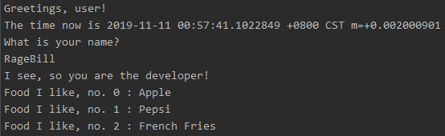

# try-golang

A demo project playing around with Golang.

Sample output when running ```go run main.go```:



# Extra notes to myself on Golang

## Variables

Declare the variable explicitly with a type
```
var name string // default value is "" (empty string)
```

Declare the variable with `:=` operator to automatically infer the type
```
name := "RageBill"
```

## Function

Take two integers `x` and `y` and return an `int` value.

```
func Addition(x int, y int) int {
   return x + y 
}
```

## Reference and Dereference

```
var name string = "RageBill"

var nameAddress *string = &name

*nameAddress = "Kelvin"

fmt.Println(name)
```

## Rand package

`rand` package always return the same value since its initial Seed is always `1`

If we need a different output everytime, we need to manually set the `Seed` by:

```
rand.Seed(time.now().unixnano())
```
